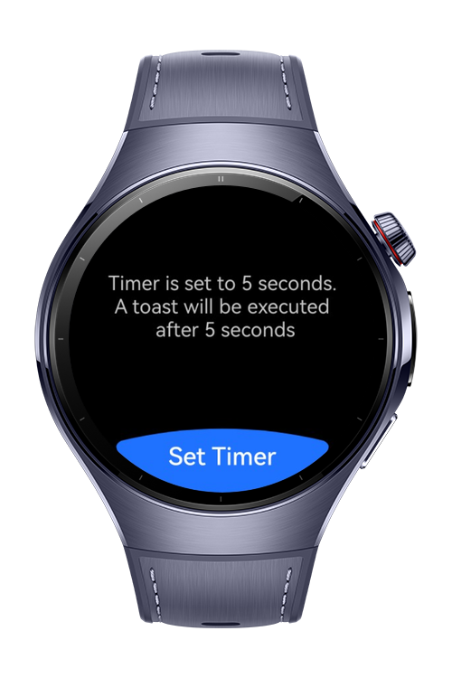
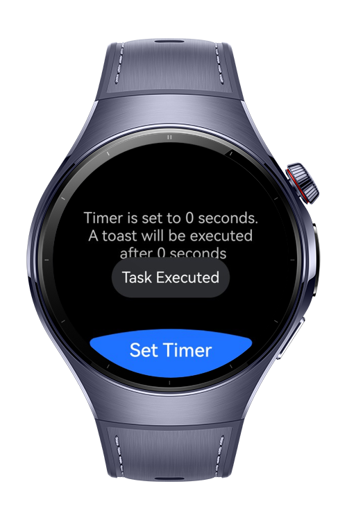
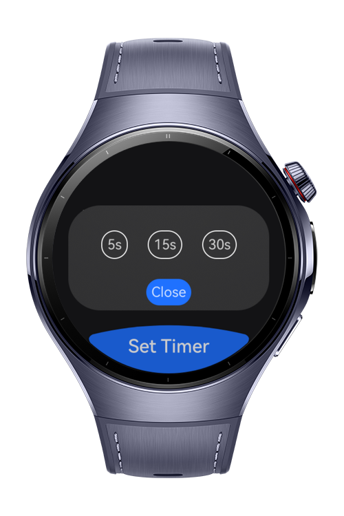

> **Note:** To access all shared projects, get information about environment setup, and view other guides, please visit [Explore-In-HMOS-Wearable Index](https://github.com/Explore-In-HMOS-Wearable/hmos-index).

# How to run code in the background
This codelab shows how to use transient background task to execute code in the background after given time.

# Preview
<div>



</div>

# Use Cases
- Set execute time
- Run the tasks in the background

# Tech Stack

- **Languages**: ArkTS, ArkUI
- **Frameworks**: HarmonyOS SDK 5.1.0
- **Tools**: DevEco Studio 5.1.0
- **Libraries**: @kit.ArkUI

## Directory Structure
```
entry/src/main/ets/
├───entryability
│       EntryAbility.ets
├───entrybackupability
│       EntryBackupAbility.ets
├───pages
│       Index.ets
└───views
        TimerView.ets
```

# Constraints and Restrictions
## Supported Device
- Huawei Watch 5

# LICENSE
**Timer Background Task** is distributed under the terms of the MIT License.
See the [license](LICENSE) for more information. 